# Tutorial - Δημιουργία φακέλου - Χρήση Windows Github

Ο πιο εύκολος τρόπος χρήσης του Github είναι ίσως με τη χρήση του Windows Github / Github for Mac. 

__Προσοχή! Βεβαιωθείτε ότι δεν θα μπει κάποιος άλλος χρήστης στο φάκελο που δημιουργείτε και δεν θα αλλάξει/σβήσει τυχόν αρχεία γιατί τότε θα προκαλέσει πρόβλημα στην εργασία σας και στις εργασίες των συμφοιτητών σας.__
__Σε περίπτωση που συμβεί κάτι τέτοιο είστε αποκλειστικά υπεύθυνοι  και θα υποστείτε βαθμολογικές κυρώσεις.__

## Εγκατάσταση του Windows Github στον _προσωπικό υπολογιστή σας_

Επισκεφτείτε το [http://windows.github.com](http://windows.github.com) και κατεβάστε το πρόγραμμα. Υπάρχουν αντίστοιχες εκδόσεις και για άλλα λειτουργικά [(https://mac.github.com/)](https://mac.github.com/). Αν χρησιμοποιείτε Linux τότε η καλύτερη επιλογή είναι να χρησιμοποείτε το Git από command line η να χρησιμοποιήσετε κάποιο άλλο [Linux Github GUI](http://stackoverflow.com/a/1518844/6309).

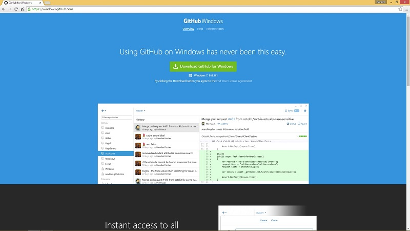

Κάνετε εγκατάσταση το Windows Github.

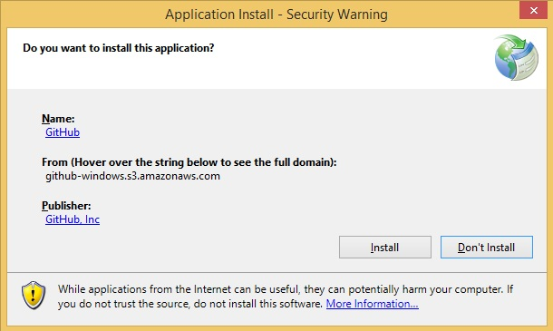

## Δημιουργία λογαριασμού στο Github

Αφού δημιουργήσετε λογαριασμό (sign up) στο [http://www.github.com](http://www.github.com) συμπληρώνετε τα απαραίτητα στοιχεία, username κλπ που ζητούνται κατά την εγκατάσταση του Windows Github.

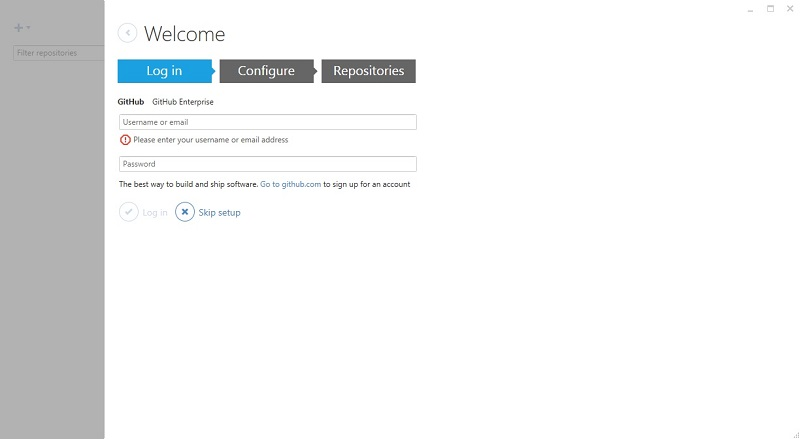

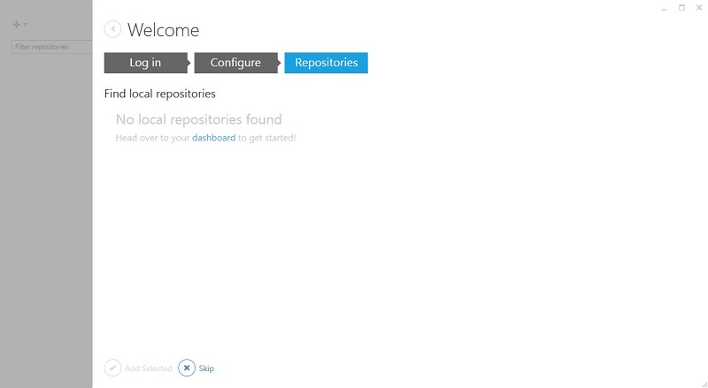

## Δημιουργία/cloning repository του μαθήματος στον _προσωπικό υπολογιστή σας_

Επιλέγετε cscw για τα Κινητά και Κοινωνικά Μέσα και πατάτε το κουμπι clone για να κατέβει το αντίστοιχο repository στον υπολογιστή σας. Επιλέγετε ένα φάκελο στον οποίο θα αποθηκευτεί το repository.

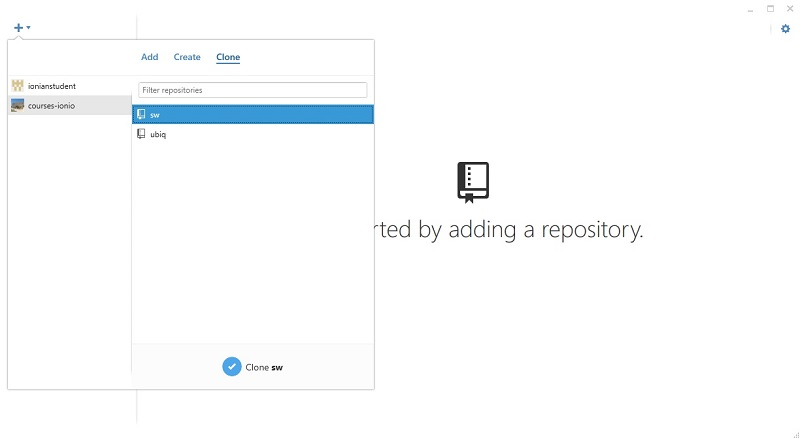

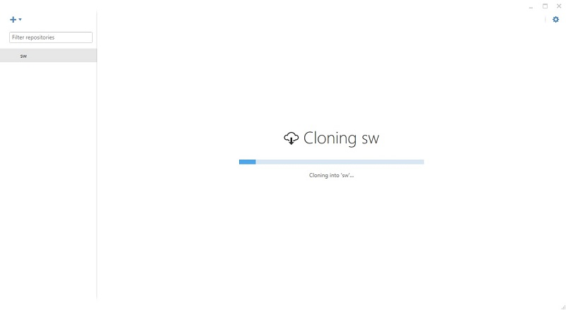

Μόλις τελειώσει το cloning θα έχετε στον υπολογιστή σας το repository ενώ το Windows Github θα σας δείχνει όλες τις αλλαγές / commit που έχουν γίνει μέχρι εκείνη τη στιγμή.

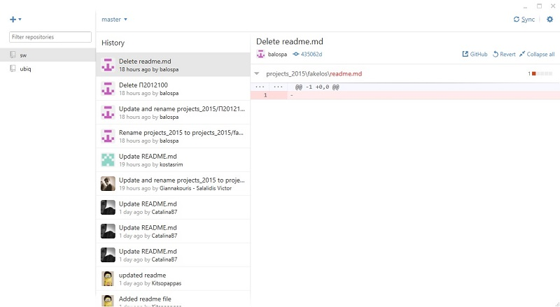

## Δημιουργία φακέλου στο repository

Βρίσκετε το φάκελο που έχετε επιλέξει για την αποθήκευση του repository και δημιουργείτε ένα νέο φάκελο με το ΑΜ σας σύμφωνα με τις [οδηγίες](../projects_2015/README.md).

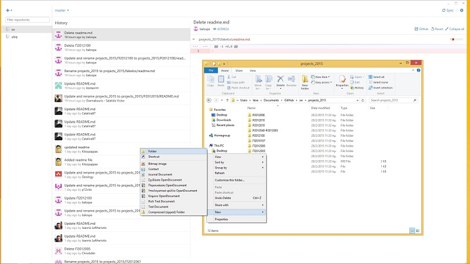

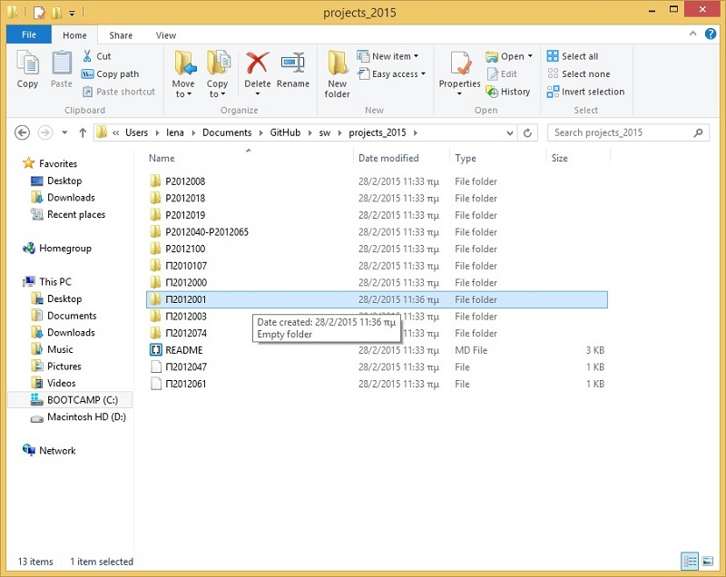

Δημιουργείτε το δικό σας αρχείο readme.md μέσα στο φάκελο που δημιουργήσατε (ή το δημιουργείτε σε έναν κειμενογράφο ή το αντιγράφετε από τον φάκελο Π2012000)

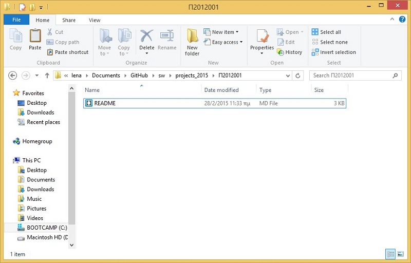

## Ενημέρωση των αλλαγών στο Github

Μετά τις αλλαγές που κάνετε αν πάτε στο Windows Github και πατήσετε το Sync πάνω δεξιά, θα σας εμφανίσει "Uncommited changes". Το Windows Github αντιλαμβάνεται ότι έχουν γίνει αλλαγές στο φάκελό σας τοπικά οι οποίες θα πρέπει να σταλθούν στο κυρίως server του Github για να υπάρχει συγχρονισμός.

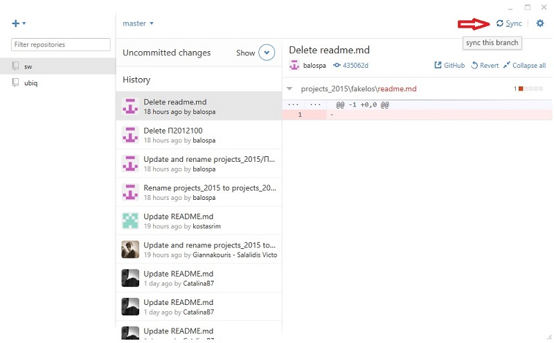

Αφού πατήσετε το show δίπλα στο "Uncommited changes", δίνετε έναν τίτλο για τις προσθήκες/αλλαγές που κάνετε και πατάτε τα αντίστοιχα κουμπιά όπως φαίνεται και στο screenshot.

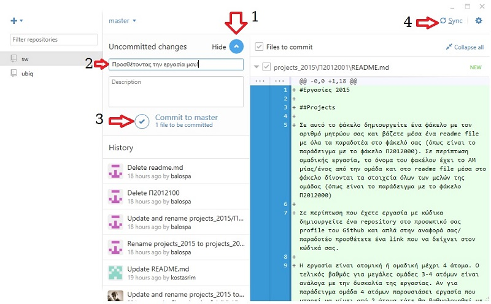

Μόλις ολοκληρωθεί το sync, θα δείτε στο Windows Github ότι οι αλλαγές που κάνατε έχουν περαστεί στο ιστορικό.

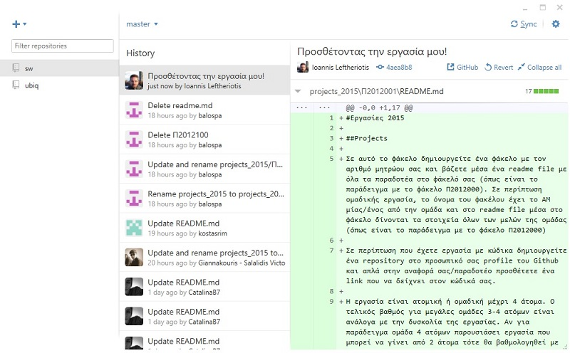

Αν επισκεφθείτε τώρα το github.com θα δείτε ότι το repository εκεί είναι συγχρονισμένο με το τοπικό repository του υπολογιστή σας και ο φάκελος που πριν λίγο δημιουργήσατε βρίσκεται κι εκεί.

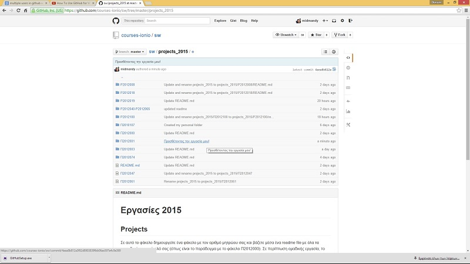

_Τα αρχεία κειμένου readme μπορείτε εύκολα να τα επεξεργαστείτε online και από το github.com, αφού τα επιλέξετε, πατώντας το κουμπάκι με το μολύβι (edit) που βρίσκεται πάνω δεξιά. Όμως, μετά να θυμάστε να κάνετε sync το τοπικό σας repositor πατώντας το κουμπί Sync στο Windows Github οπως δείξαμε και παραπάνω._
